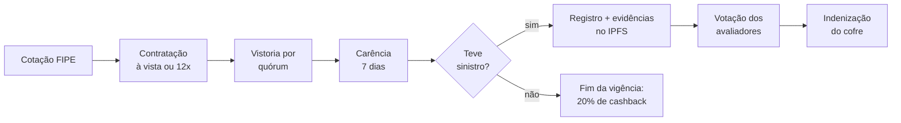

<div align="center">

# 🛡️ AutoShieldFI

**Proteção veicular descentralizada para o Brasil, na blockchain Solana**

[](https://solana.com)
[](https://www.anchor-lang.com)
[](https://nextjs.org)
[](#)
[](#programa-solana)
[](LICENSE)

🌐 **[Teste agora na Devnet](https://autoshieldfi.vercel.app)** · 💻 **[Código](https://github.com/bl4cks1d3/AutoShieldFI)** · 🇺🇸 **[English](#-english)**

</div>

---

# 🇧🇷 PT/BR

Menos de **30% dos carros do Brasil têm seguro**, principalmente por causa do preço. O AutoShieldFI é uma
alternativa mais acessível e transparente: um **pool de proteção mutualista** que roda em **smart contracts
na blockchain Solana**. O motorista contrata em minutos, aciona o sinistro pelo celular e, se não usar a
cobertura, **recebe 20% do prêmio de volta**.

> _Projeto de hackathon — ainda não é um produto de seguro regulado pela SUSEP._

## 📉 O problema

| Dado | Valor | Fonte |
|---|---|---|
| Carros com seguro | **29%** — 18,4 milhões de 63,3 milhões de automóveis | CNseg + Senatran, jul/2026 ([InfoMoney](https://www.infomoney.com.br/minhas-financas/classe-c-lidera-o-seguro-automovel-mas-71-dos-carros-ainda-nao-tem-cobertura/)) |
| Quem mais contrata | Classe C, com 41% dos clientes de seguro auto | mesmo levantamento da CNseg |
| Roubos e furtos de veículos | **367.854** em 2024 | [Anuário Brasileiro de Segurança Pública 2025](https://forumseguranca.org.br/wp-content/uploads/2025/07/anuario-2025.pdf) |
| Preço do seguro tradicional | 3% a 8% do valor FIPE por ano | cotações de corretoras (referência de mercado) |
| Sinistralidade do seguro auto | 59,4% em 2024 | dados da SUSEP ([Roncarati](https://www.editoraroncarati.com.br/v2/Artigos-e-Noticias/Artigos-e-Noticias/Seguradoras-arrecadam-R$-2076-bilhoes-em-2024-mas-lucro-liquido-cai.html)) |

Milhões de motoristas ficam expostos a acidentes, roubos e enchentes. Além do preço, pesam a burocracia no
sinistro e a falta de transparência sobre como o valor é calculado e por que um pedido é negado.

## 🚗 Como funciona

- **Cotação em segundos** pela tabela FIPE (busca por placa ou por modelo)
- **3 planos**: Básico (roubo/furto e natureza), Essencial (+ colisão) e Completo (+ terceiros)
- **Pagamento à vista ou em até 12x sem juros**, direto da carteira digital
- **Vistoria por avaliadores** antes da cobertura começar, com conferência da placa
- **Sinistro 100% digital**: fotos e documentos vão para o IPFS e o registro fica na blockchain
- **Avaliadores independentes** votam cada sinistro, com quórum, e a indenização sai automaticamente do cofre
- **Não usou? Recebe de volta**: 20% do prêmio retorna como cashback no fim da vigência
- **Investidores** aportam no pool e são remunerados pelos prêmios (staking)



### Planos e preço

`prêmio = valor FIPE × 3,5% ao ano × multiplicador do plano × dias / 365` — a fórmula é pública e roda no contrato.

| Plano | Coberturas | Multiplicador | Carro FIPE R$ 50.000, 1 ano | Cashback se não usar |
|---|---|---|---|---|
| Básico | Roubo/furto, eventos da natureza | ×0,6 | R$ 1.050 | R$ 210 |
| **Essencial** | Básico + colisão | ×1,0 | **R$ 1.750** (ou 12x de R$ 145,83) | R$ 350 |
| Completo | Essencial + danos a terceiros e outros | ×1,4 | R$ 2.450 | R$ 490 |

Franquia de 5% da FIPE só em danos parciais; roubo/furto e natureza não têm franquia. Uma taxa de vistoria
(50 tBRL) é paga na contratação.

### Para onde vai o dinheiro

De cada prêmio, **5%** vão para a tesouraria do protocolo (que remunera os avaliadores), **20%** ficam
reservados como cashback do motorista e **75%** remuneram os provedores de liquidez e pagam os sinistros.
Com os padrões, o LP tem resultado positivo enquanto a sinistralidade ficar abaixo de ~75% — o seguro auto
no Brasil fechou 2024 em 59,4%.

## 🔍 Transparência e segurança

- **Tudo auditável on-chain**: preço, franquia, regras de cobertura, cada voto e cada pagamento.
- **O cofre não tem dono**: os fundos só saem por regra do contrato (PDA), nunca por uma chave privada.
- **Solvência garantida pelo contrato**: nova apólice ou saque só passa se o pool mantiver 10% da cobertura
  ativa, e nenhuma apólice pode passar de 200% do patrimônio.
- **Antifraude**: uma apólice ativa por placa, vistoria por quórum, carência de 7 dias, cobertura só com
  parcelas em dia, avaliador impedido na própria apólice e reclassificação do tipo de sinistro.
- **Governança com timelock**: mudanças de parâmetros e avaliadores esperam 1 dia e podem ser canceladas.
- **Privacidade (LGPD)**: a placa nunca vai em texto para a blockchain, só o hash SHA-256.
- **Web segura**: CSP, proteção contra clickjacking e HSTS no frontend.

## ⚙️ Tecnologia

| Camada | Tecnologia |
|---|---|
| Blockchain | Solana (Devnet) |
| Smart contracts | Rust + Anchor 0.31 — 26 instruções |
| Frontend | Next.js 16, React 19, TypeScript e Tailwind CSS 4 |
| Mobile | PWA instalável, com página offline |
| Carteiras | Phantom, Solflare e Backpack (Wallet Standard) |
| Integrações | API da tabela FIPE, consulta por placa, IPFS (Pinata) para evidências e RPC Helius |
| Hospedagem | Vercel |
| Testes | 24 testes de integração (Anchor), 6 unitários (Rust), teste de fumaça on-chain e E2E com Playwright |

Documentação completa do produto e da arquitetura no PRD e no TRD do projeto; guia de instalação em
[docs/INSTALACAO.md](docs/INSTALACAO.md).

## 🏗️ Arquitetura

```
┌──────────────────────────┐        ┌───────────────────────────────────────────┐
│  app/ (Next.js 16 + PWA) │  RPC   │  programs/autoshield (Anchor / Solana)    │
│                          │───────▶│                                           │
│  /cotar      cotação     │        │  Pool (PDA "pool")                        │
│  /apolices   apólices    │        │   ├─ Vault (PDA "vault", token tBRL)      │
│  /sinistros  sinistros   │        │   ├─ parâmetros, avaliadores, quórum      │
│  /pool       staking LP  │        │   └─ contabilidade (cobertura, reservas)  │
│  /avaliacao  avaliadores │        │  Policy     (PDA "policy", dono, nonce)   │
│                          │        │  Claim      (PDA "claim", apólice, idx)   │
│  Modo Demo (localStorage)│        │  StakePosition (PDA "stake", pool, dono)  │
│                          │        │  VehicleRecord (PDA "vehicle", hash placa)│
│  Modo On-chain (carteira)│        │  tBRL mint  (PDA "test_mint") + faucet    │
└──────────────────────────┘        └───────────────────────────────────────────┘
```

### Modelo econômico (on-chain)

| Regra | Implementação |
|---|---|
| **Prêmio** | `valor FIPE × taxa base (3,5% a.a.) × multiplicador do plano × dias / 365` — calculado no contrato (`pricing.rs`) e espelhado no frontend (`pricing.ts`) |
| **Planos** | Básico ×0,6 (roubo/furto, natureza) · Essencial ×1,0 (+ colisão) · Completo ×1,4 (+ terceiros, outros) |
| **Franquia** | 5% da FIPE para danos parciais; roubo/furto e eventos da natureza (perda total) são isentos |
| **Cashback** | 20% do prêmio fica reservado e volta ao motorista ao fim da vigência se não houver sinistro pago |
| **Staking (LPs)** | Provedores aportam stablecoin e recebem cotas proporcionais ao patrimônio do pool; prêmios valorizam a cota e indenizações a desvalorizam |
| **Solvência** | Nova apólice ou saque só é aceito se `patrimônio ≥ 10% da cobertura ativa + sinistros pendentes` |
| **Sinistros** | Motorista registra (tipo, valor, descrição, hash SHA-256 das evidências) → comitê de avaliadores vota com quórum → pagamento permissionless direto do cofre. Sem quórum no prazo, qualquer pessoa pode encerrar o pedido |
| **Parcelamento** | À vista ou em até 12x sem juros (cada parcela cobre ao menos 30 dias). Sinistro só com parcelas em dia; atraso além da tolerância (padrão 5 dias) faz a apólice caducar e perder o cashback |
| **Receita e avaliadores** | Taxa do protocolo (padrão 5% do prêmio) vai para a tesouraria, sacável só pela autoridade. O avaliador recebe a taxa de vistoria (paga pelo motorista, padrão 50 tBRL) e uma remuneração por voto (padrão 10 tBRL) paga da tesouraria |
| **Antifraude** | Registro único por placa (PDA do hash SHA-256 da placa normalizada), travado só na vistoria aprovada — contratar a placa de outra pessoa não bloqueia o dono · vistoria prévia obrigatória (recusada = prêmio devolvido, taxa de vistoria não) · carência entre contratação e sinistro (padrão 7 dias) · valor FIPE mínimo · avaliador não vota nem vistoria a própria apólice · vistoria decidida por quórum (padrão 2) · avaliador pode reclassificar o tipo do sinistro ao aprovar |
| **Segurança do capital** | Pool só pode ser criado pela autoridade de upgrade do programa · sinistro pago apenas com o patrimônio livre dos LPs (nunca com cashback reservado ou taxas); sem liquidez ele segue aprovado, sem pagamento parcial · cotas "mortas" no primeiro aporte contra ataque de inflação · contas com versão e espaço reservado para upgrades |
| **Privacidade e evidências** | A placa nunca vai em texto para a blockchain: só o hash SHA-256 (pseudonimização, LGPD); o avaliador confere digitando a placa do documento. Fotos e B.O. vão para o IPFS (via Pinata, chave só no servidor) e o link + hash ficam no sinistro |
| **Robustez do pool** | Cobertura máxima por apólice em relação ao patrimônio (padrão 200%) · saque de LP com aviso prévio (padrão 2 dias), durante o qual as cotas seguem expostas · contas encerradas podem ser fechadas, devolvendo o aluguel em SOL |
| **Governança** | Mudanças de parâmetros e de avaliadores passam por timelock (propor → aguardar → aplicar, canceláveis) · transferência de autoridade em dois passos (propor + aceite da nova carteira) · pausa de emergência imediata |

### Instruções do programa

- **Governança:** `initialize_pool`, `propose_params`, `apply_params`, `propose_assessors`, `apply_assessors`, `cancel_pending`, `set_paused`, `propose_authority`, `accept_authority`, `withdraw_treasury`
- **Token de teste:** `init_test_mint`, `faucet`
- **Liquidez:** `deposit_liquidity`, `request_withdrawal`, `withdraw_liquidity`, `close_position`
- **Apólices:** `purchase_policy`, `pay_installment`, `inspect_policy`, `settle_policy`, `close_policy`
- **Sinistros:** `file_claim`, `vote_claim`, `expire_claim`, `pay_claim`, `close_claim`

## 🚀 Como rodar

> Guia completo (WSL, ferramentas, localnet, devnet, variáveis e solução de problemas): [docs/INSTALACAO.md](docs/INSTALACAO.md)

### Frontend (modo demonstração — não precisa de carteira)

```bash
cd app
npm install
npm run dev          # http://localhost:3000
```

O **modo Demo** simula o protocolo inteiro no navegador com as mesmas regras do contrato. Use os botões
**+7 dias / +30 dias** no topo para avançar o relógio e mostrar vencimento e cashback.

### API FIPE (por modelo e por placa)

O app expõe rotas próprias que normalizam a tabela FIPE (`app/src/lib/fipe/`):

| Rota | Retorno |
|---|---|
| `GET /api/fipe/status` | `{ modelo, placa }` — recursos habilitados no servidor |
| `GET /api/fipe/{carros\|motos\|caminhoes}/marcas` | marcas |
| `GET /api/fipe/{tipo}/marcas/{marca}/modelos` | modelos |
| `GET /api/fipe/{tipo}/marcas/{marca}/modelos/{modelo}/anos` | anos/combustível |
| `GET /api/fipe/{tipo}/marcas/{marca}/modelos/{modelo}/anos/{ano}` | preço (`FipeQuote`) |
| `GET /api/fipe/{tipo}/codigo/{codigoFipe}/anos[/{ano}]` | anos / preço pelo código FIPE |
| `GET /api/placa/{placa}` | veículo + versões FIPE compatíveis (`PlateLookup`) |

A busca por modelo usa a API pública FIPE v2 (parallelum) e funciona sem configuração. A consulta por
placa depende de um provedor pago (WDAPI2 / apiplacas.com.br): defina `PLACA_API_TOKEN` em `app/.env.local`.
Os tokens ficam só no servidor.

### Programa Solana

Requisitos: Rust, Solana CLI (Agave 2.1.x), Anchor CLI 0.31.1, Node 20+ e Yarn.

```bash
yarn install
anchor build                         # compila o programa e gera o IDL
cargo test -p autoshield             # testes unitários de precificação
anchor test                          # 24 testes de integração no validador local
```

> O `Cargo.lock` fixa `blake3 = 1.5.5` e versões compatíveis com o Rust 1.79 do toolchain SBF da Agave 2.1.
> Se atualizar dependências, rode `cargo update -p blake3 --precise 1.5.5` antes do `anchor build`.

### Deploy em devnet e uso on-chain

```bash
solana config set -u devnet
solana airdrop 2                      # repita até ter ~4 SOL (ou use faucet.solana.com)
anchor keys sync                      # gera/atualiza o Program ID no código
anchor build && anchor deploy --provider.cluster devnet
# inicializa mint tBRL, pool e 500k de liquidez. SECONDS_PER_DAY=60 acelera a demo (1 dia = 1 min)
# carência, timelock e tolerância curtos para a demo; veja scripts/bootstrap.ts para todas as variáveis
SECONDS_PER_DAY=60 CLAIM_WAITING_SECS=120 GOVERNANCE_DELAY_SECS=300 INSTALLMENT_GRACE_SECS=300 \
  ASSESSORS=<pubkey1>,<pubkey2> anchor run bootstrap --provider.cluster devnet
cd app && npm run sync-idl
cp .env.example .env.local            # ajuste NEXT_PUBLIC_PROGRAM_ID
npm run dev                           # selecione "Devnet" no topo e conecte a Phantom/Solflare
```

**Deploy público na rede de teste (somente on-chain).** Para publicar o app sem o modo demonstração
(sem seletor Demo, sem simulação local e sem os botões de avanço de tempo), use as variáveis de
`app/.env.devnet.example`:

```bash
cd app
cp .env.devnet.example .env.production.local   # ou configure as mesmas variáveis na Vercel
npm run build && npm start
```

`NEXT_PUBLIC_ENABLE_DEMO=false` força o modo on-chain e ignora qualquer preferência salva no navegador.

Teste de fumaça do cliente do frontend contra um cluster real:

```bash
# pool local com carência curta: SECONDS_PER_DAY=1 CLAIM_WAITING_SECS=2 anchor run bootstrap
cd app && RPC_URL=http://127.0.0.1:8899 npx tsx scripts/smoke-onchain.ts
```

## 🎬 Roteiro de demonstração (pitch de 3 minutos)

1. **Home** — problema (29% da frota segurada) e exemplo de preço por plano.
2. **Faucet** — pegue 50.000 tBRL no topo.
3. **Contratar** — escolha um carro popular (ou consulte a FIPE), placa `ABC1D23`, plano Essencial, 1 ano. Mostre o resumo com franquia e cashback.
4. **Avaliação → Vistorias** — aprove a vistoria como Avaliador 1 e Avaliador 2 (quórum) e clique **+7 dias** para passar a carência. Mostre também que a mesma placa não pode ser contratada de novo.
5. **Sinistros** — registre uma colisão de R$ 12.000 com fotos (vão para o IPFS; link e hash on-chain) e veja a indenização estimada já com franquia.
6. **Avaliação** — vote como Avaliador 1 e Avaliador 2 → quórum atingido → execute o pagamento.
7. **Pool & Staking** — mostre patrimônio, colateral mínimo, sinistralidade, aporte, pedido de saque com aviso prévio e valor da cota.
8. **+30 dias** — contrate um plano Básico de 30 dias, avance o tempo e **resgate o cashback** em Minhas apólices.
9. Instale o app pelo navegador do celular (PWA).

## 📁 Estrutura do repositório

```
programs/autoshield/src/   programa Anchor (state, pricing, instructions/*)
tests/autoshield.ts        testes de integração (mocha)
scripts/bootstrap.ts       inicialização de cluster (mint, pool, liquidez)
target/idl, target/types   IDL e tipos gerados
app/                       frontend Next.js + PWA
  src/app/api/             rotas de servidor (FIPE, placa, evidências no IPFS)
  src/lib/client/          cliente on-chain (Anchor) e simulador demo
  src/lib/pricing.ts       fórmula de preço espelhada do contrato
  public/sw.js             service worker (offline + instalação)
docs/INSTALACAO.md         guia de instalação passo a passo
```

## ⚠️ Limitações conhecidas (escopo de hackathon)

- tBRL é um token de teste com faucet; em produção o pool usaria uma stablecoin real (BRZ, USDC).
- Evidências no IPFS são públicas; criptografia com acesso só para avaliadores é o próximo passo.
- A precificação usa apenas valor FIPE, plano e vigência; fatores de risco (CEP, perfil, telemetria) exigiriam oráculos.
- A autoridade do pool ainda é uma carteira única com timelock; o plano é migrar para multisig (Squads).
- **Não é um produto de seguro regulado pela SUSEP.** Desde a [Lei Complementar 213/2025](https://www2.camara.leg.br/legin/fed/leicom/2025/leicomplementar-213-15-janeiro-2025-796898-norma-pl.html),
  a proteção patrimonial mutualista precisa de administradora autorizada pela SUSEP; operar fora do piloto
  exige essa parceria, uma cooperativa de seguros ou o sandbox regulatório.

## 🗺️ Próximos passos

- Piloto fechado em devnet com 20 a 50 motoristas.
- Multisig na autoridade e stake com penalidade para avaliadores.
- Evidências criptografadas e oráculo de preço FIPE.
- Bônus por anos sem sinistro e precificação por região, com resseguro para eventos catastróficos.
- Auditoria externa, stablecoin real e estrutura regulatória para a mainnet.

## 🤝 Como contribuir

1. Faça um fork do repositório
2. Clone o fork para o seu ambiente local
3. Implemente as melhorias ou correções desejadas (rode `anchor test` e `npm run build` em `app/`)
4. Envie um pull request com uma descrição detalhada das alterações

## 👥 Equipe

- Wesley Cardoso — Smart Contracts / Backend
- Jaqueline Queroz — Frontend / UX/UI
- Amanda Almeida — Business / Marketing

## 📬 Contato

Para mais informações sobre o AutoShieldFI, entre em contato pelo email: **wcsd1995@gmail.com**

Agradecemos seu interesse em tornar a proteção veicular mais acessível e eficiente para os motoristas brasileiros.

---

# 🇺🇸 English

**Decentralized vehicle protection for Brazil, on Solana.** Fewer than 30% of Brazilian cars are insured,
mostly because of price. AutoShieldFI is a more affordable and transparent alternative: a **mutual protection
pool** running on **Solana smart contracts**. Drivers buy coverage in minutes, file claims from their phone and,
if they don't use the coverage, **get 20% of the premium back**.

🌐 **[Try it on Devnet](https://autoshieldfi.vercel.app)** · _Hackathon project — not a SUSEP-regulated insurance product._

## The problem

Only **29%** of Brazil's 63.3 million cars are insured (CNseg + Senatran, July 2026), while the country recorded
**367,854** vehicle thefts and robberies in 2024 (Brazilian Public Security Yearbook 2025). Traditional insurance
costs 3% to 8% of the car's FIPE value per year, claims are bureaucratic and pricing is opaque.

## How it works

- **Instant quote** from the FIPE price table (search by plate or by model)
- **3 plans**: Basic (theft, natural events), Essential (+ collision) and Complete (+ third parties)
- **Pay upfront or in up to 12 interest-free installments** straight from the wallet
- **Assessor inspection** (quorum) before coverage starts, with plate verification
- **100% digital claims**: photos and documents go to IPFS and the record lives on-chain
- **Independent assessors** vote on each claim with a quorum; the payout comes automatically from the vault
- **Didn't use it? Get paid back**: 20% of the premium returns as cashback at the end of the term
- **Liquidity providers** stake in the pool and earn from premiums

Pricing is public and computed on-chain: `premium = FIPE value × 3.5%/yr × plan multiplier (0.6 / 1.0 / 1.4) × days / 365`.
A R$ 50,000 car on the Essential plan pays R$ 1,750 a year (or 12 × R$ 145.83) and gets R$ 350 back if there
is no paid claim. Each premium splits into 5% protocol fee, 20% reserved cashback and 75% for LPs and claims.

## Transparency and security

- Price, deductible (5% of FIPE for partial damage), coverage rules, every vote and every payout are on-chain.
- The vault is controlled by a PDA; no private key can move the funds.
- Solvency is enforced on every purchase and withdrawal (10% minimum collateral; per-policy cap of 200% of net assets).
- Anti-fraud: one active policy per plate, quorum inspection, 7-day waiting period, coverage only with installments
  up to date, assessors can't act on their own policies and can reclassify the claim type.
- Timelocked governance, two-step authority transfer, emergency pause, LP withdrawals with a notice period.
- Privacy (LGPD): plates are stored only as a SHA-256 hash. The web app ships CSP, anti-clickjacking headers and HSTS.

## Tech stack

Solana · Rust + Anchor 0.31 (26 instructions) · Next.js 16, React 19, TypeScript, Tailwind CSS 4 · installable PWA ·
Phantom, Solflare and Backpack wallets · FIPE API, plate lookup, IPFS (Pinata) and Helius RPC · hosted on Vercel ·
24 integration tests, 6 unit tests, on-chain smoke test and Playwright E2E.

## Running

- **App (demo mode, no wallet needed):** `cd app && npm install && npm run dev`
- **Program:** `yarn install && anchor build && anchor test`
- **Devnet:** deploy, then `anchor run bootstrap --provider.cluster devnet` to create the tBRL test mint, the pool and seed liquidity.
  Public deploys set `NEXT_PUBLIC_ENABLE_DEMO=false` (see `app/.env.devnet.example`).

Full step-by-step guide (in Portuguese): [docs/INSTALACAO.md](docs/INSTALACAO.md).

## Team

- Wesley Cardoso — Smart Contracts / Backend
- Jaqueline Queroz — Frontend / UX/UI
- Amanda Almeida — Business / Marketing

## Contact

**wcsd1995@gmail.com** · Licensed under [Apache 2.0](LICENSE).
